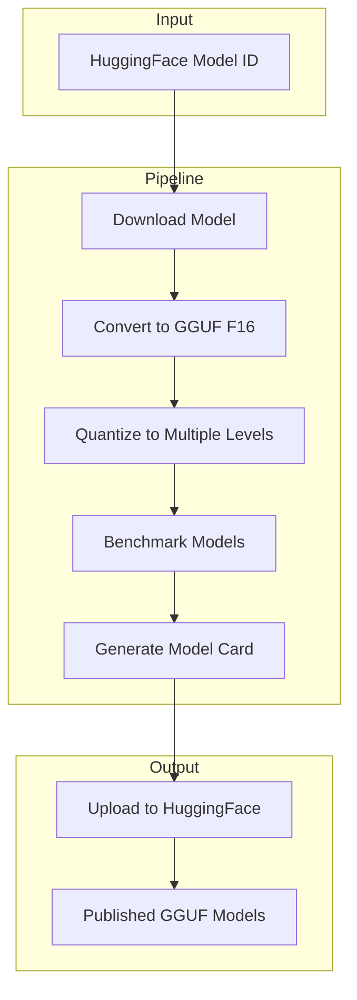
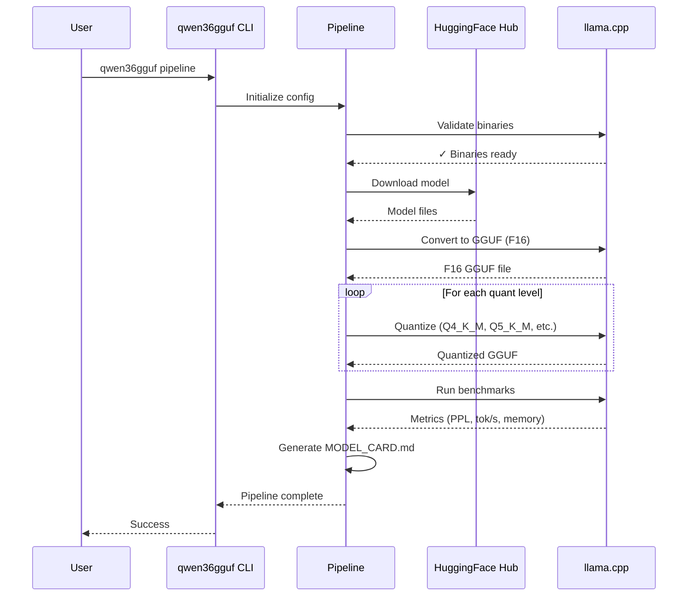

# QWEN36GGUF: Qwen3.6-27B GGUF Quantization Pipeline

> 🤖 **Made Autonomously Using [NEO](https://heyneo.com)** — Your Autonomous AI Engineering Agent
>
> [](https://marketplace.visualstudio.com/items?itemName=NeoResearchInc.heyneo) [](https://marketplace.cursorapi.com/items/?itemName=NeoResearchInc.heyneo)

Production-ready GGUF quantization pipeline for Qwen3.6-27B with benchmarking and HuggingFace publishing.

## Features

- **Automated Pipeline**: Download → Convert → Quantize → Benchmark → Upload
- **Multiple Quantization Levels**: Q4_K_M, Q5_K_M, Q6_K, Q8_0, and more
- **Benchmarking Suite**: Perplexity, throughput (tok/s), and memory usage metrics
- **HuggingFace Integration**: Automated model card generation and publishing
- **Smoke Testing**: Validate pipeline with TinyLlama before production runs
- **CUDA Support**: Built with CUDA acceleration for optimal performance

## Architecture



## Installation

```bash
# Clone the repository
git clone <repo-url>
cd qwen36gguf

# Setup llama.cpp with CUDA support
bash scripts/setup.sh

# Install Python package with uv or pip
pip install -e .
# or
uv pip install -e .
```

### Prerequisites

- Python 3.10+
- CUDA-capable GPU (optional but recommended)
- CMake 3.14+
- GCC/Clang compiler

## Usage

### Quick Start - Smoke Test

Validate the entire pipeline with TinyLlama (1.1B parameters):

```bash
qwen36gguf smoke
```

This will:
1. Download TinyLlama-1.1B-Chat-v1.0
2. Convert to F16 GGUF format
3. Quantize to Q4_K_M
4. Run benchmarks
5. Generate `out/smoke/MODEL_CARD.md`

### Full Pipeline

Run the complete quantization pipeline for Qwen3.6-27B:

```bash
qwen36gguf pipeline \
    --model-id Qwen/Qwen3.6-27B \
    --output-dir out/deepseek-v4-flash \
    --quant-levels Q4_K_M,Q5_K_M,Q6_K,Q8_0 \
    --hf-repo-id your-username/Qwen3.6-27B-GGUF
```

### Individual Commands

```bash
# Download a model from HuggingFace
qwen36gguf download Qwen/Qwen3.6-27B --output-dir models/

# Convert HuggingFace model to GGUF format
qwen36gguf convert models/Qwen3.6-27B --outtype f16

# Quantize GGUF model
qwen36gguf quantize model-f16.gguf Q4_K_M --output-path model-Q4_K_M.gguf

# Benchmark a quantized model
qwen36gguf benchmark model-Q4_K_M.gguf
```

## Pipeline Workflow



## Configuration

Environment variables (prefix: `QWEN36GGUF_`):

```bash
export QWEN36GGUF_MODEL_ID="Qwen/Qwen3.6-27B"
export QWEN36GGUF_OUTPUT_DIR="/path/to/output"
export QWEN36GGUF_LLAMA_CPP_DIR="/path/to/llama.cpp"
export QWEN36GGUF_HF_REPO_ID="username/repo-name"
export QWEN36GGUF_HF_PRIVATE="true"
```

## Project Structure

```
.
├── src/qwen36gguf/          # Main package
│   ├── cli.py             # Click CLI interface
│   ├── config.py          # Configuration classes
│   ├── download.py        # HuggingFace model download
│   ├── convert.py         # HF to GGUF conversion
│   ├── quantize.py        # GGUF quantization
│   ├── bench.py           # Benchmarking suite
│   ├── card.py            # Model card generation
│   ├── upload.py          # HuggingFace upload
│   └── pipeline.py        # Pipeline orchestrator
├── scripts/
│   └── setup.sh           # llama.cpp setup script
├── vendor/
│   └── llama.cpp/         # Pinned llama.cpp submodule
├── tests/                 # Test suite
├── out/                   # Output directory
└── README.md              # This file
```

## Quantization Types

Supported quantization levels (the four shipped by `qwen36gguf smoke` and the default `pipeline`):

| Type | Description | Use Case |
|------|-------------|----------|
| Q2_K | 2-bit K-quants, aggressive compression | Edge / mobile, very limited RAM |
| Q4_K_M | 4-bit K-quants medium, balanced quality / size | General purpose, recommended |
| Q5_K_S | 5-bit K-quants small, better quality | Quality-critical applications |
| Q8_0 | 8-bit, near-lossless | Maximum fidelity, reference |

`qwen36gguf` also accepts any other type llama.cpp supports (Q4_0, Q5_K_M, Q6_K, F16, …) via `--quant-levels`.

## Benchmark Results

### Production run: Qwen3.6-27B on a Tesla V100 (16 GB VRAM)

Real numbers from the full pipeline (`qwen36gguf pipeline --model-id Qwen/Qwen3.6-27B`) plus a follow-up GPU re-bench for the larger quants. WikiText-2 perplexity at `--ctx-size 512 --parallel 1`; `pp512` / `tg128` from `llama-bench`. The `-ngl` column is the layer-offload setting that fit V100's VRAM cap (smaller quants fit fully, larger ones spill to CPU). Bundle is at `out/qwen36-27b/hf_export/`.

| Model | File size (MB) | Perplexity ↓ | pp512 t/s ↑ | tg128 t/s ↑ | -ngl (perp / bench) |
|---|---:|---:|---:|---:|:--:|
| Qwen3.6-27B-Q2_K.gguf   | 10215.44 | 6.8364 ± —     |  —      | 37.03 | 99 / 99 |
| Qwen3.6-27B-Q4_K_M.gguf | 15780.83 | 5.9013 ± 0.160 | 360.89  |  4.88 | 50 / 50 |
| Qwen3.6-27B-Q5_K_S.gguf | 17814.27 | 5.7555 ± 0.154 | 402.79  |  4.98 | 42 / 53 |
| Qwen3.6-27B-Q8_0.gguf   | 27271.04 | 5.7384 ± 0.153 | 133.71  |  1.98 | 28 / 35 |

#### Perplexity by quant (Qwen3.6-27B)

```mermaid
xychart-beta
    title "Qwen3.6-27B GGUF: WikiText-2 perplexity (lower = better)"
    x-axis ["Q2_K", "Q4_K_M", "Q5_K_S", "Q8_0"]
    y-axis "Perplexity" 5.5 7.0
    bar [6.84, 5.90, 5.76, 5.74]
```

#### File size by quant (Qwen3.6-27B)

```mermaid
xychart-beta
    title "Qwen3.6-27B GGUF: file size on disk (GB)"
    x-axis ["Q2_K", "Q4_K_M", "Q5_K_S", "Q8_0"]
    y-axis "Size (GB)" 0 30
    bar [10.0, 15.4, 17.4, 26.6]
```

**Read:** Q4_K_M is the value pick for Qwen3.6-27B — it lands within ~0.16 perplexity of Q8_0 at ~58 % the file size and gets the highest measured `pp512` of the four (360.89 t/s with -ngl 50 on V100). Q2_K halves the size again at the cost of ~0.94 perplexity. Throughput numbers reflect the partial offload setup; on a 24 GB+ GPU all four converge on the Q2_K headline number.

> Pipeline self-test (`qwen36gguf smoke` on TinyLlama-1.1B) lives at `out/smoke/MODEL_CARD.md` and is intentionally not reproduced here — it validates the toolchain, not the model.

## Development

```bash
# Install development dependencies
pip install -e ".[dev]"

# Run tests
pytest tests/ -v --cov=qwen36gguf

# Run linting
ruff check src/qwen36gguf/
mypy --strict src/qwen36gguf/

# Format code
ruff format src/qwen36gguf/
```

## License

MIT License

---

**Note**: This is a production-ready pipeline. For large models like Qwen3.6-27B, ensure you have sufficient GPU memory (>16GB recommended) and disk space (>100GB recommended).
